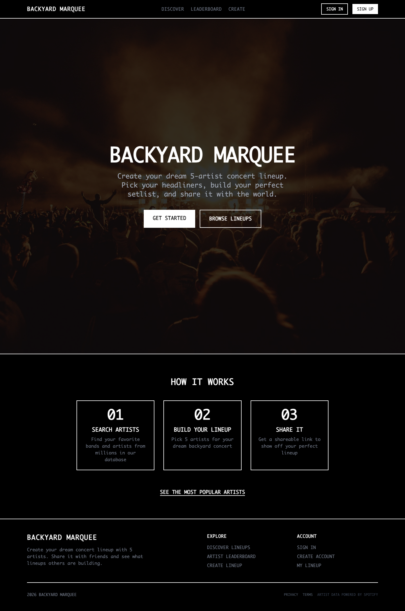
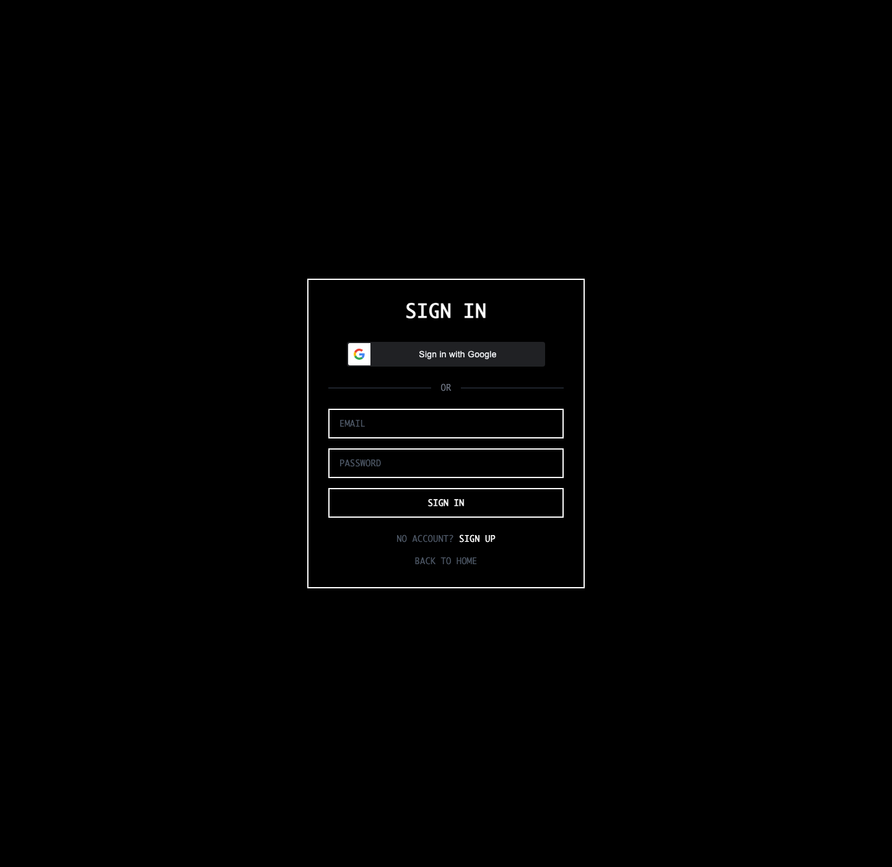

# Backyard Marquee

Backyard Marquee is a concert lineup builder for creating, sharing, and discussing dream 5-artist bills.

It combines artist search, lineup creation, comments, likes, leaderboard views, and social preview cards into one public-facing app.

## Live App

- Frontend: https://backyard-marquee.vercel.app
- Canonical site: https://backyardmarquee.thediffraction.com
- API: https://backyard-marquee-api.onrender.com

## What It Does

- Search artists from Spotify data
- Build a 5-artist lineup
- Publish lineups with shareable URLs
- Add comments and likes
- Browse popular lineups and artists
- Generate OG previews for lineup links

## Screenshots






## Stack

- React 18 + Vite
- Express 5
- Turso / SQLite
- JWT auth
- Google OAuth
- Vercel frontend
- Render API

## Public/Auth Behavior

- Anyone can browse public content.
- Signed-in users can create and manage their own lineups.
- The app also supports guest creation for quick lineup drafts.

## Public Repo Notes

This is a public demo/product repo. Do not commit `.env` files, real API keys, OAuth secrets, database tokens, private user exports, logs, or moderation/admin data.

## Local Development

The project uses separate `client/` and `server/` apps.

### Server

```bash
cd server
npm install
npm run dev
```

### Client

```bash
cd client
npm install
npm run dev
```

## Environment Variables

### `server/.env`

```bash
TURSO_DATABASE_URL=
TURSO_AUTH_TOKEN=
JWT_SECRET=
SPOTIFY_CLIENT_ID=
SPOTIFY_CLIENT_SECRET=
GOOGLE_CLIENT_ID=
FRONTEND_URL=
PORT=3001
```

### `client` build env

```bash
VITE_API_URL=https://backyard-marquee-api.onrender.com/api
```
